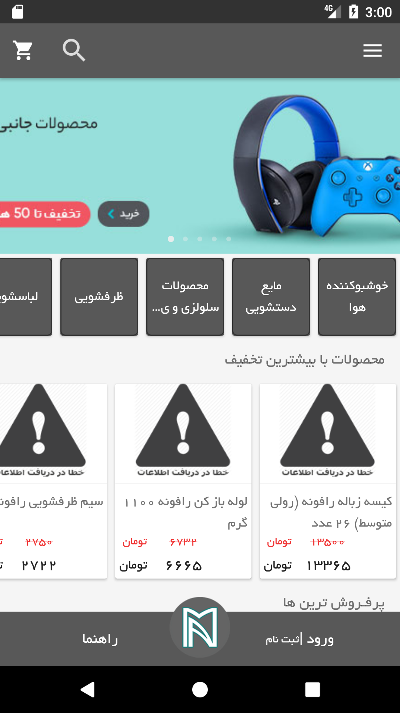
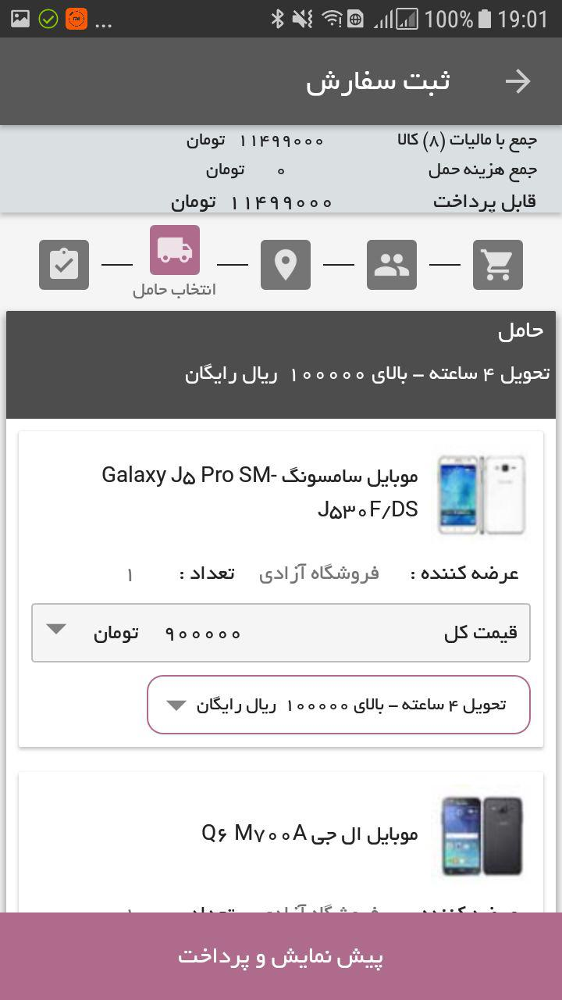

# 🛍️ Online Shop (Android App)

A sleek and user-friendly online shopping app built for Android, allowing users to browse and shop products directly from their mobile devices. Developed using Java, XML, and Retrofit for seamless integration with REST APIs, this app provides a smooth and responsive shopping experience.

The UI was designed and implemented by myself, ensuring an intuitive and modern interface for all users.

## 🚀 Features
- 🛒 **Product Browsing**: Easily browse through a wide range of products.
- 🔍 **Search & Filter**: Find your favorite items quickly with advanced search features.
- 📦 **Order Tracking**: Track your orders directly through the app.
- 🖼️ **Custom UI**: Designed a modern and clean user interface for a great user experience.

## 🛠️ Tech Stack
- **Java**: The core programming language used to build the app.
- **XML**: Used for designing the user interface.
- **Retrofit Library**: Integrated RESTful APIs for dynamic data exchange between the app and the server.

## 📸 Screenshots

| Product List | Product Detail | Checkout Screen |
|--------------|----------------|-----------------|
|  |  |  |
|  |  | |

## 📲 Installation
1. Clone the repository:
   ```bash
   git clone https://github.com/yourusername/online-shop-android.git
